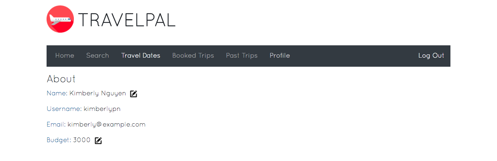

# TravelPal

**Collaborators**: Kimberly Nguyen, Longsheng Lin, Matt Dang, William Guo

**TravelPal**: https://travelpal.kimberlypn.com

**Course Website**: http://www.ccs.neu.edu/home/ntuck/courses/2018/01/cs4550/

## Introduction
TravelPal is a social flights application that allows users to search for and
book flights and hotels, maintain a diary of past trips, and keep up with their
friends’ travels. The application aims to serve as a platform for travelers on
a budget and to provide a smooth trip-planning experience.

## Getting Started
When users first visit the home page, they will be prompted with a log-in form.

If users do not have an account, they can use the registration link below the
log-in form to create one. This link will toggle the registration form.

## Home
After logging in, users will be redirected to the "Home" page where they can
view their social feed. The "Friends' Trips" section displays all of the booked
trips of the user's friends.

Below this section is a "Popular Flights" section, where the application
recommends potential trips based on the user's budget. Users can click the
"Book" button in the bottom-right of a flight card in order to start the
booking process.

## Search
When first clicked, the "Search" page will display a form, where users can enter
in details about the flight for which they would like to search.

After clicking "Submit" in the bottom-right of the form, or if the user clicks
the "Book" button of a flight card from the "Home" page or the "Search" button
of a travel date card from the "Travel Dates" page, the application will display
all of the flights that it was able to find that matched the user's preferences.

If no flights have been found, then the application will display a "No Flights
Available" message. Users can start a new search by clicking the "New Search"
button in the top-right, which will redisplay the search form.

If users find a satisfactory flight, then they can click the "Book" button in
the bottom-right of the flight card. The application will then list hotels near
the searched destination. Users can skip this step by clicking the "Skip Hotel
Booking" button in the top-right.

After successfully booking a flight, a message will be displayed telling users
what to do next.

## Travel Dates
The “Travel Dates” page is where users can organize potential trips.

Users can click the “+ Add” button in the top right to create a new travel date
card. Clicking this will toggle the "New Travel Date" form.

The "Search" button starts the booking process using the details from the
travel date card (see section "Search Page"). The "Delete" button allows users
to delete the travel date card. The "Edit" button allows users to edit the
details of a travel date card. Clicking the "Edit" button toggles the edit form.

## Booked Trips
The “Booked Trips” page shows all of the trips that the user has booked,
organized by trips this month and future trips.

Users can click the "View Itinerary" button in the bottom-right of a booked trip
card to view the itinerary for that trip. Clicking this button again will
redisplay the overview of the trip. Users can delete a booked trip by clicking
the "Unbook" button.

Users can edit the details of a booked trip by clicking the "Edit" button, which
will toggle the edit form.

## Past Trips
The “Past Trips” page shows all of the trips that the user has booked and gone
on.

Users can click the "View Itinerary" button in the bottom-right of a past trip
card to view the itinerary for that trip. Clicking this button again will
redisplay the overview of the trip. Users can delete a booked trip by clicking
the "Delete" button.

Users can edit the summary of a past trip by clicking the "Edit" button, which
will toggle the edit form.

## Profile
The “Profile” page shows the user’s information and friends.

Users can edit their name or budget by clicking the pencil icon beside the
corresponding field in the "About" section. Doing so will toggle an input field
for the user to input the new value.

Users can search for friends by username or name by clicking the "Find Friends"
button in the top-right of the "Friends" section. Doing so will toggle a search
bar, below which any results will be listed as the user types.

Users can click on a search result to view that user's profile. From this page,
users can friend or unfriend the user.

